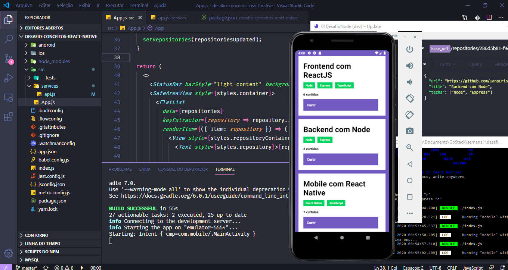

<h3 align="center">
  Desafio 04: Conceitos do React Native
</h3>

<p align="center">“Sucesso não é o resultado de um jogo, mas o destino de uma jornada”!</blockquote>

<p align="center">
  

  <a href="https://rocketseat.com.br">
    
  </a>

  

  <a href="https://github.com/Rocketseat/bootcamp-gostack-desafios/stargazers">
    
  </a>
</p>

<p align="center">
  <a href="#rocket-sobre-o-desafio">Sobre o desafio</a>&nbsp;&nbsp;&nbsp;|&nbsp;&nbsp;&nbsp;
  <a href="#calendar-entrega">Entrega</a>&nbsp;&nbsp;&nbsp;|&nbsp;&nbsp;&nbsp;
  <a href="#memo-licença">Licença</a>
</p>

## :rocket: Sobre o desafio

Nesse desafio, foi criado uma aplicação para treinar os conhecimento adquiridos com React Native!

Desenvolver uma aplicação que irá armazenar repositórios do seu portfólio, usando a API desenvolvida utilizando o Node.js.

<hr>

## :checkered_flag: Instalação 

Instala todas as dependências 

``` 
  yarn install 
```

### Funcionalidades da aplicação

- **`Listar os repositórios da API`**: Deve ser capaz de criar uma lista de todos os repositórios que estão cadastrados na API com os campos **title**, **techs** e número de curtidas seguindo o padrão `${repository.likes} curtidas`, apenas alterando o número para ser dinâmico.

- **`Curtir um repositório listado da API`**: Deve ser capaz de curtir um item na sua API através de um botão com o texto **Curtir** e deve atualizar o número de likes na listagem no mobile.


### Resultados

<h1 align="left">
  
</h1>

## :memo: Licença

Esse projeto está sob a licença MIT. Veja o arquivo [LICENSE](LICENSE) para mais detalhes.

---

Feito com 💜 by Iana Cris :wave: [Linkedin](https://www.linkedin.com/in/ianasousa/)
